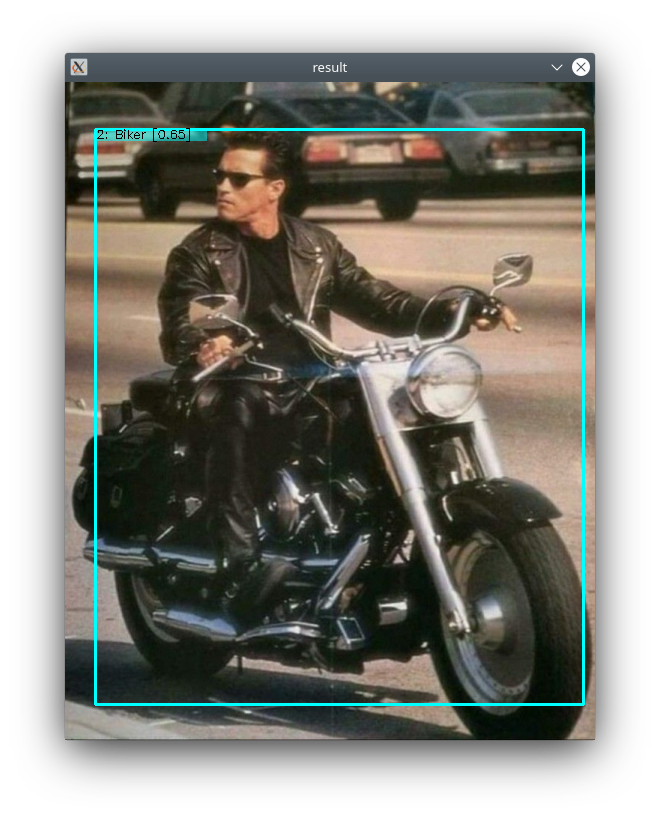

# dummy_console_app

[](https://github.com/Extended-Object-Detection-ROS/dummy_console_app/issues) [](https://opensource.org/licenses/BSD-3-Clause)   
Simplest console application for basic [Extended Object Detection](https://github.com/Extended-Object-Detection-ROS) project testing.  
For project documentation please [follow link](https://github.com/Extended-Object-Detection-ROS/wiki_english/wiki).  
For more advanced version please use [QT GUI](https://github.com/Extended-Object-Detection-ROS/qt_gui_eod).

## Install 
(Tested on Linux Kubuntu 20.04 LTS)
You must have OpenCV 4.2.0 installed
### 1. Download repo
```
git clone --recurse-submodules https://github.com/Extended-Object-Detection-ROS/dummy_console_app
```

### 2. (Optional) install igraph library
If you want to use Complex Object Detection
```
mkdir tmp
cd tmp
curl -O https://igraph.org/nightly/get/c/igraph-0.7.1.tar.gz
tar -xzf igraph-0.7.1.tar.gz
rm igraph-0.7.1.tar.gz

sudo mv igraph-0.7.1 /usr/local/src/
cd /usr/local/src/igraph-0.7.1
./configure
make
make check
sudo make install
```
Then in file dummy_console_app/CMakeLists.txt change line 8 at
```
set(igraph ON)
```
### 3. Build application
```
cd dummy_console_app
mkdir build
cd build
cmake ..
make
```

## Run
```
./dummy_console_app <path to object base XML file> <path to image to detect> [optional: names of objects to detect]
```
If no object names to detect are provided then all objects in the base will be detected.


## Examples
You can take ready object base with provided examples from https://github.com/Extended-Object-Detection-ROS/opencv_blog_olympics_examples  
And perform biker detection (with igraph installed) with command like:
```
./dummy_console_app /home/anton/Pictures/opencv_blog_olympics_examples/objectbase/ObjectBase.xml /home/anton/Pictures/opencv_blog_olympics_examples/images/judgment_day_alone_75.jpg Biker
```




